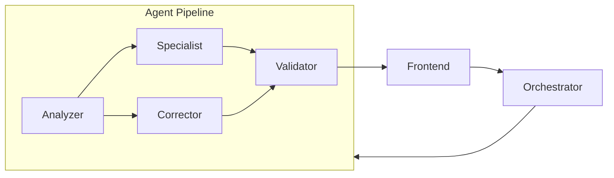
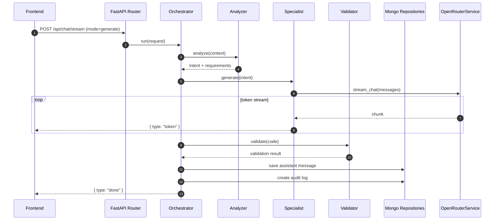
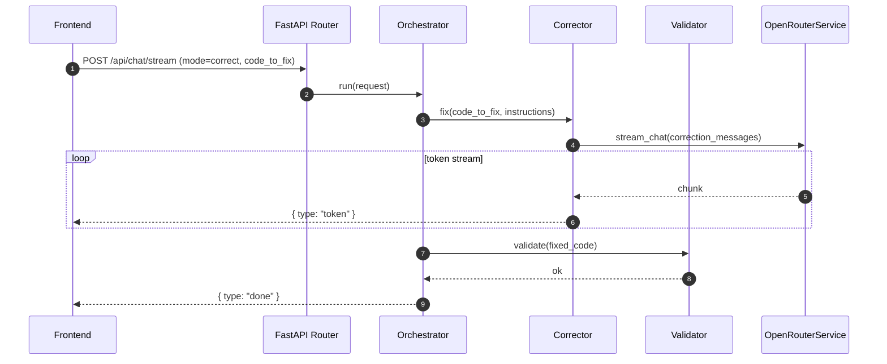
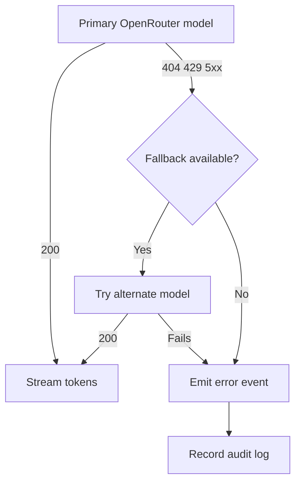

# FrameForge Backend

Backend API for FrameForge built with FastAPI, Motor, and MongoDB. It receives prompts, orchestrates a multi-agent AI pipeline, reconstructs thread context, consumes OpenRouter via streaming, separates explanation from React code, persists the conversation, and exposes endpoints that the frontend consumes in real time.

## Purpose

- Orchestrate the generation and correction of React components through a specialized agent pipeline.
- Maintain a history of threads and messages with full audit trail.
- Emit incremental responses as NDJSON for a fluid UI experience.
- Isolate the OpenRouter integration so the provider can be swapped with minimal impact.
- Record audit events and operational errors.

## Stack

- FastAPI for async HTTP with type safety.
- Motor for async access to MongoDB.
- httpx for calls to OpenRouter.
- Pydantic Settings for environment-based configuration.
- Pytest for unit tests.

## Architecture

Responsibilities are separated by layer:

- `app/api`: HTTP layer, routers, and dependency injection.
- `app/agents`: Multi-agent pipeline — Orchestrator, Analyzer, Specialist, Corrector, Validator.
- `app/services`: Application logic and external provider clients.
- `app/repositories`: Data access and persistence.
- `app/models`: Domain contracts and API schemas.
- `app/prompts`: System prompt and LLM response rules.
- `app/db`: MongoDB connection and initialization.
- `app/core`: Configuration, logging, and cross-cutting constants.

## Agent Pipeline

Each request goes through a specialized pipeline following SRP and the Open/Closed principle:

| Agent | Responsibility |
|---|---|
| `Orchestrator` | Coordinates the pipeline; routes `generate` vs `correct` workflows; emits NDJSON tokens |
| `Analyzer` | Parses user intent, previous context, and component requirements |
| `Specialist` | Generates the React component; single-file output with all sub-components inlined |
| `Corrector` | Applies targeted fixes to an existing component based on user feedback |
| `Validator` | Verifies the generated/corrected code has a valid export default |



## Folder structure

```text
backend/
├─ app/
│  ├─ agents/
│  │  ├─ __init__.py
│  │  ├─ base.py          # BaseAgent abstract class
│  │  ├─ orchestrator.py  # Pipeline coordinator
│  │  ├─ analyzer.py      # Intent and context analysis
│  │  ├─ specialist.py    # Component generation
│  │  ├─ corrector.py     # Component correction
│  │  └─ validator.py     # Output validation
│  ├─ api/
│  │  ├─ dependencies.py
│  │  ├─ router.py
│  │  └─ routes/
│  │     ├─ chat.py
│  │     └─ threads.py
│  ├─ core/
│  │  ├─ config.py
│  │  └─ logging.py
│  ├─ db/
│  │  └─ mongo.py
│  ├─ models/
│  │  ├─ domain.py
│  │  └─ schemas.py
│  ├─ repositories/
│  │  ├─ audit_log_repository.py
│  │  ├─ message_repository.py
│  │  └─ thread_repository.py
│  ├─ services/
│  │  ├─ chat_service.py
│  │  ├─ code_parser.py
│  │  └─ openrouter_service.py
│  └─ main.py
├─ tests/
├─ Dockerfile
├─ docker-compose.yml
├─ requirements.txt
└─ README.md
```

## Main flow — Generate mode

1. Frontend sends `POST /api/chat/stream` with `mode: "generate"`.
2. `ChatService` delegates to `AgentOrchestrator`.
3. `Analyzer` extracts intent, component type, and requirements from context.
4. `Specialist` generates the full React component with Tailwind.
5. `Validator` checks the code for obvious issues.
6. `Synthesizer` merges explanation and code into the streaming response.
7. Each token is emitted as NDJSON to the frontend in real time.
8. On completion the assistant message is persisted and an audit record is created.



## Correct mode flow



## Error and fallback flow



## Endpoints

### Health

- `GET /health`: confirms the application is running.

### Threads

- `GET /api/threads`: lists threads ordered by last update.
- `GET /api/threads/{thread_id}/messages`: returns the full message history of a thread.
- `DELETE /api/threads/{thread_id}`: deletes a thread and all its messages.

### Chat

- `POST /api/chat/stream`: starts generation or correction and responds in NDJSON.

## Streaming format

The response uses `application/x-ndjson` with events such as:

- `thread`: data for the current thread.
- `message`: echo of the persisted user message.
- `token`: incremental chunk from the assistant.
- `done`: final assistant message with `content` and `code_snippet`.
- `error`: serialized error detail.

Conceptual example:

```json
{"type":"thread","thread":{"id":"...","title":"User profile badge"}}
{"type":"token","content":"Here is "}
{"type":"token","content":"a compact badge"}
{"type":"done","message":{"id":"...","code_snippet":"export default function ..."}}
```

## Environment variables

Defined in `.env.example`:

- `APP_NAME`: name exposed by the API.
- `ENVIRONMENT`: logical environment, e.g. `development`.
- `DEBUG`: enables FastAPI debug mode.
- `API_PREFIX`: base prefix, currently `/api`.
- `MONGO_URI`: MongoDB connection string.
- `MONGO_DB_NAME`: database name.
- `OPENROUTER_API_KEY`: real API key for remote generation.
- `OPENROUTER_BASE_URL`: provider base URL.
- `OPENROUTER_MODEL`: primary model slug (default: `meta-llama/llama-3.1-8b-instruct:free`).
- `OPENROUTER_FALLBACK_MODELS`: comma-separated list of fallback slugs tried in order when the primary returns 429/404.
- `OPENROUTER_FALLBACK_MODEL`: legacy single fallback (kept for backward compatibility).
- `FRONTEND_URL`: used in CORS and OpenRouter headers.
- `MAX_CONTEXT_MESSAGES`: context window per thread.
- `REQUEST_TIMEOUT_SECONDS`: HTTP client timeout.

## Local development

```bash
cd backend
python -m venv .venv
.venv\Scripts\activate      # Windows
# source .venv/bin/activate  # macOS / Linux
pip install -r requirements.txt
copy .env.example .env       # Windows
# cp .env.example .env       # macOS / Linux
uvicorn app.main:app --reload --port 8000
```

The API will be available at `http://localhost:8000`.

## Demo mode without an API key

If `OPENROUTER_API_KEY` is empty, the backend returns a local demo response so the UI flow keeps working. This lets you test chat, persistence, and preview at zero cost.

## Docker

### Backend only

```bash
cd backend
docker build -t frameforge-backend .
docker run --rm -p 8000:8000 --env-file .env frameforge-backend
```

### Full stack from the repo root

```bash
docker compose up --build
```

### Full stack from the backend folder

```bash
cd backend
docker compose up --build
```

Services started:

- MongoDB on `localhost:27017`
- Backend on `localhost:8000`
- Frontend on `localhost:5173`

> **Note:** this compose assumes the current monorepo layout where `frontend` exists as a sibling folder of `backend`. If you publish them as separate repositories, replace the frontend service's `build.context` with a published image.

## Running tests

```bash
cd backend
pytest
```

## Design notes

- `OpenRouterService` encapsulates headers, streaming, and model fallback.
- `ChatService` concentrates orchestration and keeps HTTP concerns separate from business logic.
- `code_parser.py` separates the explanation from the JSX/TSX block so the frontend does not need to infer free-form format.
- The system prompt requires the model to always return exactly one default-exported code block with safe prop defaults.

## Recommended future extensions

- Authentication and per-user thread separation.
- AI-generated thread titles instead of simple truncation.
- Richer metrics and traces in `AuditLogs`.
- Integration tests covering MongoDB and end-to-end streaming.

